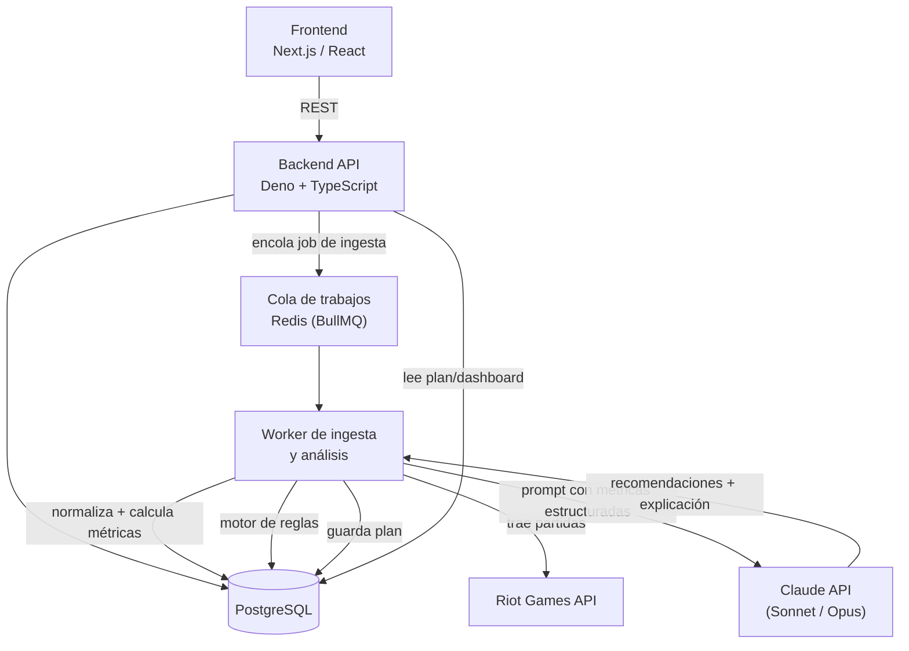

# Arquitectura y modelo de datos — Alcance Seminario Profesional 2

> Alcance de esta entrega: **solo League of Legends**. Motor de recomendación: **reglas + LLM (Claude)**, sin motor de ML propio. Backend en **TypeScript/Deno**. Ver decisiones completas en la memoria del proyecto.
>
> El esquema está diseñado para que las funcionalidades adicionales sugeridas por el catedrático (individual vs. equipo, horario/sesión, setup/experimentos, cohortes) se puedan agregar **después**, sin rediseñar las tablas base. Al final de este documento hay una sección que explica cómo engancha cada una.

## 1. Arquitectura lógica



Flujo end-to-end:
1. Usuario se registra/inicia sesión y vincula su cuenta de Riot (`riot_accounts`).
2. El usuario (o un cron) dispara una ingesta de las últimas N partidas → se encola un job.
3. El worker descarga las partidas de la Riot API, normaliza los datos y calcula las métricas (KPIs).
4. El motor de reglas evalúa las métricas y detecta debilidades recurrentes.
5. Esas debilidades + métricas estructuradas se envían a Claude, que genera el plan semanal y la explicación en lenguaje natural, anclada a los datos (grounding obligatorio — el prompt exige citar la métrica exacta, no inventar causas).
6. El dashboard muestra historial, tendencias y el plan actual.
7. El usuario marca cumplimiento de cada ítem del plan → en la siguiente ventana de partidas el sistema reevalúa.

## 2. Modelo de datos

El modelo entidad-relación completo (diagrama, diccionario de datos y decisiones de normalización) está en su propio documento: [modelo-entidad-relacion.md](modelo-entidad-relacion.md).

Resumen de entidades: `users`, `riot_accounts`, `ingestion_jobs`, `matches`, `match_participants`, `match_metrics`, `weaknesses`, `training_plans`, `training_plan_items`, `plan_progress`.

## 3. Cómo engancharían las funcionalidades futuras (sin rediseñar lo anterior)

| Funcionalidad | Cómo se agrega después |
|---|---|
| Individual vs. equipo | Query nueva sobre `match_participants` (ya tiene las 10 filas) — sin tabla nueva. |
| Rendimiento por horario/sesión | Query nueva sobre `matches.game_creation` — sin tabla nueva. |
| Setup + experimentos A/B | Tablas nuevas `player_setups`, `setup_change_events`, `experiments` con FK a `riot_accounts` — no tocan las tablas existentes. |
| Cohortes comparables | Servicio de solo lectura que agrega `match_metrics` agrupando por rol/rango/región — no tocan las tablas existentes (requiere sí tener suficiente volumen de jugadores, o datos públicos agregados). |
| Multi-juego / adapters (visión de tesis) | Se reemplazaría `matches`/`match_participants` por una capa de adapter que normalice al mismo modelo — es el cambio más grande, por eso se dejó fuera de esta entrega. |

## 4. Endpoints REST (backend Deno)

```
POST   /auth/register
POST   /auth/login
POST   /accounts/link                       # vincula cuenta de Riot (puuid)
POST   /accounts/:id/ingest                 # dispara ingestion_job de N partidas
GET    /accounts/:id/matches
GET    /accounts/:id/metrics?from=&to=
GET    /accounts/:id/weaknesses
GET    /accounts/:id/plans/current
POST   /plans/:planId/items/:itemId/progress
POST   /plans/:planId/reevaluate
```

## 5. Stack confirmado

- Frontend: React + TypeScript / Next.js
- Backend: Deno + TypeScript
- Base de datos: PostgreSQL
- Cola: Redis + BullMQ (o equivalente TS)
- IA: Claude API (Sonnet por defecto, Opus como comparación opcional) vía `@anthropic-ai/sdk`
- Riot API: SDK TS (`twisted`) o llamadas REST directas
- Contenedores: Docker
- CI/CD: GitHub Actions
