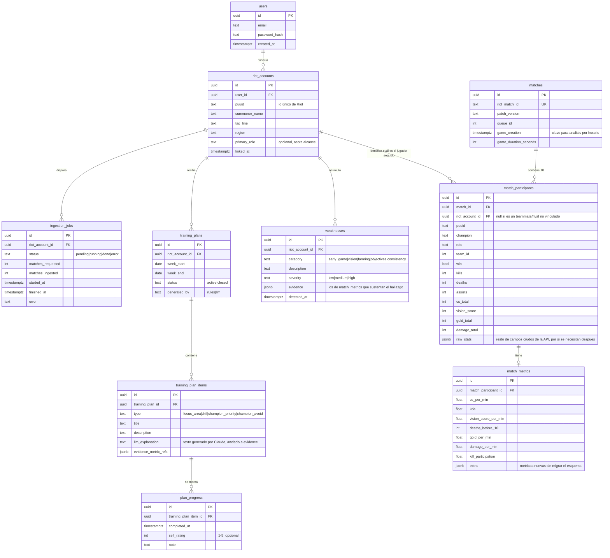

# Modelo Entidad-Relación

> Alcance: solo League of Legends, motor de reglas + LLM. Ver [propuesta.md](propuesta.md) y [arquitectura.md](arquitectura.md) para el contexto completo.

## Diagrama

## Diccionario de datos

### `users`
Cuenta de la aplicación (no confundir con la cuenta de Riot).

| Campo | Tipo | Descripción |
|---|---|---|
| id | uuid, PK | Identificador interno |
| email | text, único | Login |
| password_hash | text | Hash de contraseña (nunca texto plano) |
| created_at | timestamptz | Alta del usuario |

### `riot_accounts`
Cuenta de League of Legends vinculada a un usuario. Un usuario podría vincular más de una (multi-cuenta), por eso es una tabla aparte y no columnas en `users`.

| Campo | Tipo | Descripción |
|---|---|---|
| id | uuid, PK | Identificador interno |
| user_id | uuid, FK → users.id | Dueño de la cuenta vinculada |
| puuid | text, único | Identificador estable de Riot (no cambia si el jugador cambia de nombre) |
| summoner_name / tag_line | text | Nombre visible actual |
| region | text | Servidor (LAN, NA, etc.) — necesario para las llamadas a la API |
| primary_role | text, nullable | Rol principal declarado, usado para acotar el alcance de análisis |
| linked_at | timestamptz | Fecha de vinculación |

### `ingestion_jobs`
Registro de cada corrida de ingesta (para trazabilidad y para que el dashboard muestre progreso/errores).

| Campo | Tipo | Descripción |
|---|---|---|
| id | uuid, PK | Identificador del job |
| riot_account_id | uuid, FK | Cuenta para la que se ingesta |
| status | text | `pending`, `running`, `done`, `error` |
| matches_requested / matches_ingested | int | Control de cuántas partidas se pidieron vs. se lograron procesar |
| started_at / finished_at | timestamptz | Duración del job |
| error | text, nullable | Detalle si falló (rate limit, timeout, etc.) |

### `matches`
Una partida, deduplicada por `riot_match_id` — si dos jugadores vinculados coincidieron en la misma partida, no se duplica la fila.

| Campo | Tipo | Descripción |
|---|---|---|
| id | uuid, PK | Identificador interno |
| riot_match_id | text, único | Identificador de Riot para la partida |
| patch_version | text | Parche en el que se jugó (para versionar heurísticas del motor de reglas) |
| queue_id | int | Tipo de cola (Ranked Solo/Duo, etc.) |
| game_creation | timestamptz | Timestamp de inicio — base para el análisis por horario/día |
| game_duration_seconds | int | Duración de la partida |

### `match_participants`
Una fila por cada uno de los 10 jugadores de una partida. Solo las filas del jugador vinculado tienen `riot_account_id` distinto de null; las otras 9 se guardan igual para no perder la posibilidad de comparar individual vs. equipo más adelante.

| Campo | Tipo | Descripción |
|---|---|---|
| id | uuid, PK | Identificador interno |
| match_id | uuid, FK | Partida a la que pertenece |
| riot_account_id | uuid, FK, nullable | Si es el jugador seguido por la plataforma; null si es teammate/rival |
| puuid | text | Identificador de Riot de ese participante (aunque no esté vinculado) |
| champion / role / team_id | text/int | Datos de composición |
| win | bool | Resultado de su equipo |
| kills/deaths/assists/cs_total/vision_score/gold_total/damage_total | int | Estadísticas crudas de la API |
| raw_stats | jsonb | Resto de campos que la API devuelve y que hoy no se explotan, por si hacen falta después |

### `match_metrics`
KPIs derivados, calculados a partir de `match_participants` — separado de la tabla anterior para no mezclar "dato crudo de la API" con "dato calculado por nosotros" (son ciclos de vida distintos: si cambia una fórmula, se recalcula esta tabla sin re-ingerir nada).

| Campo | Tipo | Descripción |
|---|---|---|
| id | uuid, PK | Identificador interno |
| match_participant_id | uuid, FK, único | Participante al que pertenece (1 a 1) |
| cs_per_min / kda / vision_score_per_min / deaths_before_10 / gold_per_min / damage_per_min / kill_participation | float/int | KPIs definidos en el objetivo específico 2 |
| extra | jsonb | Métricas nuevas que se agreguen sin migrar el esquema |

### `weaknesses`
Debilidad recurrente detectada por el motor de reglas, agregada a nivel de cuenta (no de una sola partida).

| Campo | Tipo | Descripción |
|---|---|---|
| id | uuid, PK | Identificador interno |
| riot_account_id | uuid, FK | Cuenta a la que aplica |
| category | text | `early_game`, `vision`, `farming`, `objectives`, `consistency` |
| description | text | Descripción generada por el motor de reglas |
| severity | text | `low`/`medium`/`high` |
| evidence | jsonb | Lista de `match_metrics.id` que sustentan el hallazgo — es lo único que el LLM puede citar al explicar |
| detected_at | timestamptz | Cuándo se detectó |

### `training_plans` / `training_plan_items` / `plan_progress`
El plan semanal, sus ítems accionables, y el registro de cumplimiento que cierra el ciclo diagnóstico → plan → práctica → reevaluación.

| Tabla | Campo | Tipo | Descripción |
|---|---|---|---|
| training_plans | id | uuid, PK | Identificador del plan |
| training_plans | riot_account_id | uuid, FK | Dueño del plan |
| training_plans | week_start / week_end | date | Ventana que cubre |
| training_plans | status | text | `active`/`closed` |
| training_plans | generated_by | text | `rules`/`llm`, para trazabilidad de qué motor lo generó |
| training_plan_items | id | uuid, PK | Identificador del ítem |
| training_plan_items | training_plan_id | uuid, FK | Plan al que pertenece |
| training_plan_items | type | text | `focus_area`/`drill`/`champion_priority`/`champion_avoid` |
| training_plan_items | title / description | text | Contenido del ítem |
| training_plan_items | llm_explanation | text | Texto generado por Claude, anclado a `evidence_metric_refs` |
| training_plan_items | evidence_metric_refs | jsonb | `match_metrics.id` citados — mecanismo de grounding |
| plan_progress | id | uuid, PK | Identificador del registro |
| plan_progress | training_plan_item_id | uuid, FK | Ítem que se está marcando |
| plan_progress | completed_at | timestamptz | Cuándo se marcó cumplido |
| plan_progress | self_rating | int, nullable | Autoevaluación 1-5 |
| plan_progress | note | text, nullable | Comentario libre del usuario |

## Decisiones de normalización

- **`match_participants` vs. `match_metrics` separadas**: dato crudo vs. dato calculado tienen ciclos de vida distintos (recalcular una fórmula no debería requerir re-ingerir la partida).
- **`weaknesses` es independiente de una partida puntual**: una debilidad es un patrón a través de varias partidas, no pertenece a una sola fila de `match_metrics` — por eso referencia varias vía el campo `evidence`.
- **Sin tabla intermedia entre `match_participants` y `riot_accounts`**: es una FK directa nullable, porque la relación es 1 a muchos simple (una cuenta aparece en muchas partidas; un participante de una partida es a lo sumo una cuenta vinculada).
- **Columnas `jsonb` de escape** (`raw_stats`, `extra`, `evidence`, `evidence_metric_refs`) en vez de tablas EAV: para un modelo con un conjunto de métricas conocido y acotado (alcance de un solo juego), columnas fijas + un escape jsonb es más simple de consultar que un modelo Entidad-Atributo-Valor completo, que se justificaría más si soportaran múltiples juegos con métricas muy distintas entre sí.
